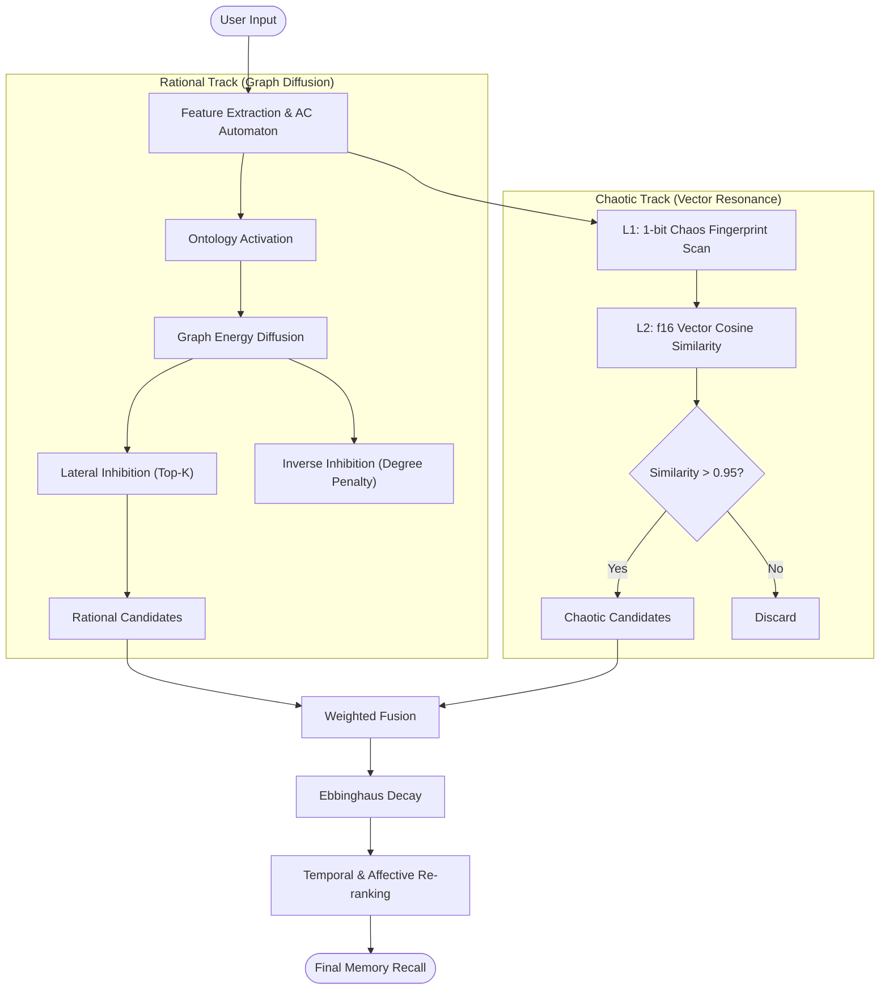

<div align="center">

<!-- 动态渐变头图 -->


<br/>

<!-- 动态打字效果 Slogan -->
<a href="https://github.com/YoKONCy/PEDSA">
  
</a>

<br/>

<!-- 声明 -->
<a href="./1. 项目白皮书.md">
  
</a>

<br/><br/>

<!-- 徽章导航 -->
<a href="#-technical-architecture">
  
</a>
&nbsp;
<a href="#-theoretical-foundation">
  
</a>
&nbsp;
<a href="#-performance">
  
</a>
&nbsp;
<a href="#-features">
  
</a>

<br/><br/>

</div>

---

<br/><br/>

<div align="center">

> **"如无必要，勿增实体；少即是好，易即是难"**
>
> _"Entities should not be multiplied unnecessarily."_

<br/>

</div>

<div align="center">

<!-- 动态分隔线 -->


<br/>

## 📋 Table of Contents

<details open>
<summary><b>Quick Navigation</b></summary>
<br/>

| Section | Description                              |                Link                 |
| :-----: | :--------------------------------------- | :---------------------------------: |
|   📖    | **Whitepaper** - 项目核心白皮书          |    [Read](./1.%20项目白皮书.md)     |
|   🧠    | **Philosophy** - 设计哲学与核心理念      |        [Jump](#-philosophy)         |
|   🔬    | **Theory** - 脑科学与认知科学理论基础    |  [Jump](#-theoretical-foundation)   |
|   🏗️    | **Architecture** - V2 架构演进与技术细节 |  [Jump](#-technical-architecture)   |
|   🎮    | **Usage Guide** - 双 LLM 管道最佳实践    |        [Jump](#-usage-guide)        |
|   ⚡    | **Performance** - 千万级节点压测报告     |        [Jump](#-performance)        |
|   🔮    | **Dual-Track** - 理性与混沌双轨检索机制  | [Jump](#-dual-track-retrieval-flow) |

</details>

<br/>

<div align="center">
  
</div>

<br/>

<!-- 动态分隔线 -->


<br/>
</div>

## 🌟 Philosophy

**PEDSA** (Parallel Energy Diffusion Spreading Activation) 是一个基于脑科学与认知心理学理论构建的 **RAG-less** 记忆检索引擎。

在当前 RAG 检索为主流的时代，大多数系统依赖于单纯的向量相似度检索。然而，人类的记忆并非简单的“关键词匹配”，而是基于**联想**、**情感**与**时空**的复杂网络。

## 🔬 Theoretical Foundation

PEDSA 的底层架构深度借鉴了现有的类脑记忆提取与情感认知的一系列成熟理论：

1.  **激活扩散模型 (Spreading Activation Model)**
    - 记忆以语义网络形式存储，能量沿关联路径扩散，实现“由点及面”的联想检索。
2.  **艾宾浩斯遗忘曲线 (Ebbinghaus Forgetting Curve)**
    - 引入 `Ebbinghaus Decay` 与 `tau` 半衰期，动态计算记忆节点的残余能量，模拟人类对近期事件的鲜活记忆。
3.  **普拉切克情感轮 (Plutchik's Wheel of Emotions)**
    - 在 SimHash 指纹中预留 `MASK_AFFECTIVE`，通过位运算模拟情感色彩的共鸣 (Affective Resonance)。
4.  **混沌情感理论 (Chaos Theory of Emotion)**
    - 引入 `Chaotic Track`，当理性检索无法给出确定答案时，通过微小的扰动触发生维度的“灵感”跃迁。
5.  **侧向抑制与反向抑制 (Lateral & Inverse Inhibition)**
    - 模拟神经系统的信号处理，抑制弱噪声信号（侧向抑制）并降低高频通用概念的权重（反向抑制）。

<br/>

## 🏗️ Technical Architecture

PEDSA V2 是一次彻底的底层重构。我们选用了先进的 TriviumDB 作为数据库引擎——**[TriviumDB](https://crates.io/crates/triviumdb)**。

### Core Technologies (Powered by TriviumDB)

- **Index-Carrier Split (SoA)**: `TriviumDB` 原生支持将指纹、ID 和元数据提取为 **Struct of Arrays** 布局，极大提升缓存命中率。
- **Zero-copy mmap**: 利用内存映射技术，实现 10M+ 节点的**微秒级冷启动**。
- **SIMD Acceleration**: 使用 **AVX2** 指令集并行处理 SimHash 距离计算，性能提升显著。
- **LSM-tree Buffer**: 引入热插入缓冲区，支持无停机增量更新。
- **Temporal Intelligence**: 智能解析“今天”、“昨天”、“刚才”等相对时间概念，并将其映射到绝对时间轴。
- **GLiNER-X-Base (NER)**: 通过 [`gline-rs`](https://github.com/fbilhaut/gline-rs) 集成 ONNX 推理，结合 `jieba-rs` 预分词，零样本提取实体类型与时间 span，替代硬编码的 `contains()` 特征匹配。GLiNER 为可选依赖，未部署模型时自动降级为关键词匹配。

### 🔄 Dual-Track Retrieval Flow

当用户输入文本时，PEDSA 采用**理性 (Rational) 与 混沌 (Chaotic) 双轨并行架构**：



<br/>

## 🎮 Usage Guide

为了让 PEDSA 发挥出“越用越聪明”的记忆特性，我们推荐采用 **"Dual-LLM Pipeline" (双 LLM 管道)** 的最佳实践模式。

### 1. The Builder (构建者)

**Role**: 负责将非结构化的对话流转化为结构化的图谱指令。

- **Trigger**: 在每轮对话结束 (Post-Chat) 后调用。
- **Prompt**: 使用 [2. 图谱构建提示词.md](./2.%20图谱构建提示词.md)。
- **Input**: 当前对话上下文 (User + AI) + Reference Time。
- **Output**: 生成 `new_event` (事件节点) 与 `ontology_updates` (本体关联) 的增量 JSON。
- **Effect**: 随着对话轮次的增加，Ontology 层会自动捕获用户偏好、习惯与专有词汇，使检索精度呈指数级提升。

### 2. The Arbiter (仲裁者)

**Role**: 负责解决逻辑冲突与知识一致性维护。

- **Trigger**: 仅当 Builder 返回 `action: "replace"` 指令时触发 (例如：用户说 "我不喜欢红色了，现在喜欢蓝色")。
- **Prompt**: 使用 [3. 图谱修复提示词.md](./3.%20图谱修复提示词.md)。
- **Mechanism**:
  1.  PEDSA 引擎提取冲突主体的 **1-hop Ego-network** (局部子图)。
  2.  Arbiter LLM 接收子图与新事实，判断哪些旧边 (Old Edges) 需要被物理删除。
  3.  引擎执行 `delete_targets` 清理操作，实现知识自愈。

> **Pro Tip**: 这种 "Write-heavy" 的设计确保了 PEDSA 不需要昂贵的全局重训练，每一次对话都是一次实时的微调 (Real-time Fine-tuning)。

<br/>

## ⚡ Performance

针对 **1000 万级** 节点的实时检索场景评估：

| Metric           | Value           | Note                                             |
| :--------------- | :-------------- | :----------------------------------------------- |
| **Total Nodes**  | **10,000,000+** | 包含磁盘数据与热插入缓冲区                       |
| **Memory Usage** | **~380 MB**     | 极度优化的 SoA 存储结构                          |
| **Scan Latency** | **132 ms**      | 全量混沌检索扫描 (SIMD)                          |
| **Throughput**   | **High**        | 支持高并发查询                                   |
| **Hot Insert**   | **Supported**   | 无需重启即可实现增量更新                         |
| **Precision@k**  | **100%**        | Top-1 & Top-5 (基于 15 个硬核 Ground Truth 测试) |

<br/>

## 🛠️ Project Structure

```bash
PEDSA/
├── models/                    # 预训练模型 (BGE-M3 GGUF, GLiNER-X-Base ONNX)
├── python/                    # Python 包
│   └── pedsa/__init__.py      #   PyO3 原生模块的 re-export 入口
├── src/
│   ├── main.rs                # 入口 (纯 CLI 路由，20 行)
│   ├── lib.rs                 # 库导出 + 条件编译 python 模块
│   ├── tests.rs               # 集成测试 (19 个场景 + Precision@k)
│   ├── python.rs              # PyO3 绑定
│   │
│   ├── core/                  # 🧠 核心引擎
│   │   ├── types.rs           #   数据结构 (Node, GraphEdge, ChaosStore)
│   │   ├── simhash.rs         #   多模态语义指纹算法
│   │   ├── stopwords.rs       #   停用词表
│   │   ├── engine.rs          #   AdvancedEngine 定义与核心方法
│   │   ├── retrieval.rs       #   多级检索管线 + DPP 多样性采样
│   │   └── ontology.rs        #   本体维护 + LTD 剪枝 + 逻辑仲裁
│   │
│   ├── ml/                    # 🤖 机器学习模型集成
│   │   ├── embedding.rs       #   Candle BGE-M3 嵌入模型
│   │   ├── gliner_ner.rs      #   GLiNER-X-Base NER (可选, gline-rs + jieba-rs)
│   │   └── inference_engine.rs#   GGUF 推理引擎
│   │
│   ├── data/                  # 📦 数据层
│   │   ├── dataset.rs         #   领域测试数据集 (6 域 + Ontology)
│   │   └── data_loader.rs     #   数据加载策略 (持久化基座已全面升级为 TriviumDB)
│   │
│   └── bench/                 # ⏱️ 基准测试
│       ├── benchmarks.rs      #   V2 + 千万级压力测试
│       └── benchmark_latency.rs#  单文本向量化延迟基准
│
├── .cargo/config.toml         # C/C++ CRT 统一配置 (/MD)
├── Cargo.toml                 # Rust 项目配置 (features: default, gliner, python)
├── pyproject.toml             # Python 包配置 (maturin + Python 3.12)
├── .python-version            # Python 版本锁定 (3.12.13)
├── 1. 项目白皮书.md            # 详细技术文档
├── 2. 图谱构建提示词.md         # 核心 Prompts - 构建
├── 3. 图谱修复提示词.md         # 核心 Prompts - 仲裁
└── README.md                  # 你正在读的文档
```

### 🚀 Quick Start

#### Rust CLI

```bash
# 默认模式：运行全部测试场景 (19 scenarios + Precision@k)
cargo run

# V2 基准测试
cargo run -- --v2

# 千万级压力测试
cargo run -- --10m

# 单文本向量化延迟基准
cargo run -- --latency
```

#### Python (via PyO3)

```bash
# 1. 安装 Python 3.12 + uv 虚拟环境
uv venv --python 3.12

# 2. 安装 maturin 并编译原生扩展
uv pip install maturin
.venv/Scripts/maturin develop --release    # Windows
# .venv/bin/maturin develop --release      # Linux/macOS
```

```python
import pedsa

# 创建引擎
engine = pedsa.Engine()

# 构建图谱
rust_id = engine.get_or_create_feature("rust")
engine.add_event(100, "Rust 在嵌入式领域取得重大突破")
engine.add_edge(rust_id, 100, 0.95)
engine.maintain_ontology("rust", "内存安全", "equality", 0.9)

# 编译 & 检索
engine.compile()
results = engine.retrieve("Rust 内存安全")
for nid, score in results:
    print(f"[{nid}] {score:.4f}: {engine.get_node_content(nid)}")

# 图谱遍历
node = engine.get_node(100)          # 完整节点信息 (dict)
edges = engine.get_edges(rust_id)    # 邻居列表 [(tgt, strength, type)]
all_ids = engine.all_node_ids()      # 所有节点 ID

# 持久化
engine.export_to_sqlite("memory.db")
engine.import_from_sqlite("memory.db")
```

<br/>

## 📝 Note

> "这个项目本质上是一个 Graph 引擎。具体能检索到什么，完全取决于图构建得怎么样，所以几乎没什么通用性。不过，就我自用而言，单论在 AIRP 场景的记忆检索下，效果还挺不错的就是了。"

### Feature Flags

| Feature | 默认 | 说明 |
| :--- | :---: | :--- |
| `gliner` | ✅ | GLiNER-X-Base ONNX NER (gline-rs + ort)，禁用后降级为关键词匹配 |
| `python` | ❌ | PyO3 绑定，通过 `maturin develop` 构建时自动启用 |

> **Windows 构建注意**: `esaxx-rs`（`tokenizers` 的间接依赖）与 `ort_sys` 之间存在 CRT 不匹配 (`/MT` vs `/MD`)。项目通过 `.cargo/config.toml` 设置 `CFLAGS=/MD` 统一为动态 CRT，已解决。Python 构建 (`maturin develop`) 默认禁用 `gliner` feature 以避开 ONNX Runtime 链接冲突。

<br/>

<div align="center">
  
</div>
